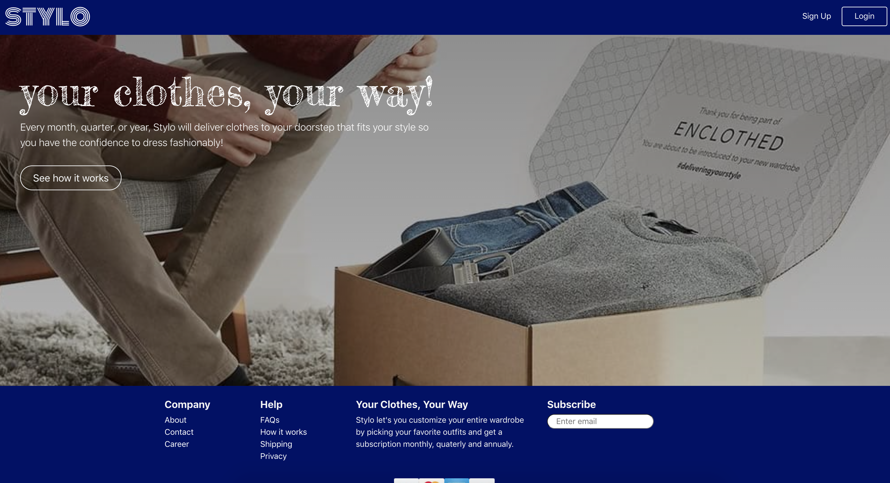
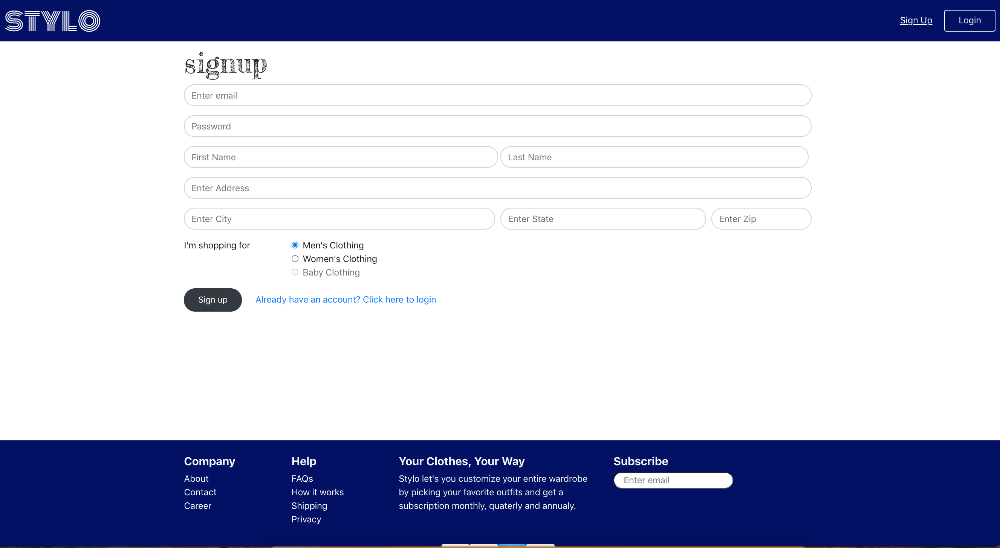
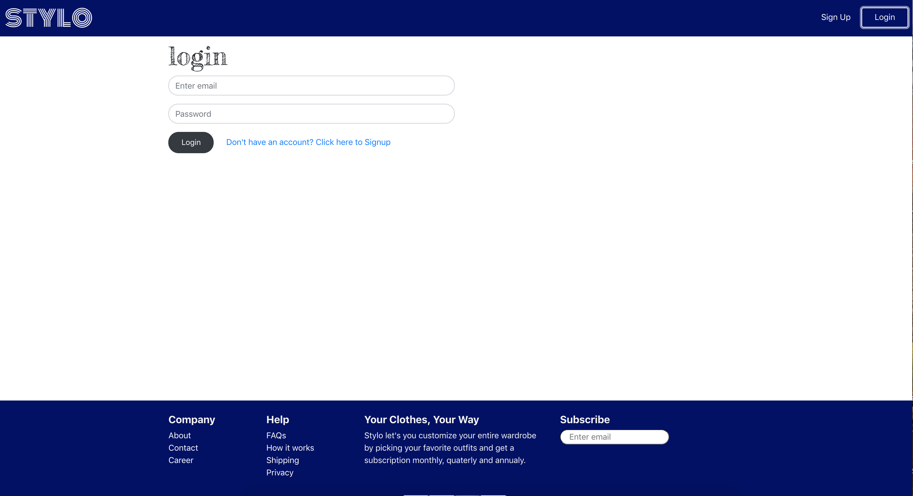
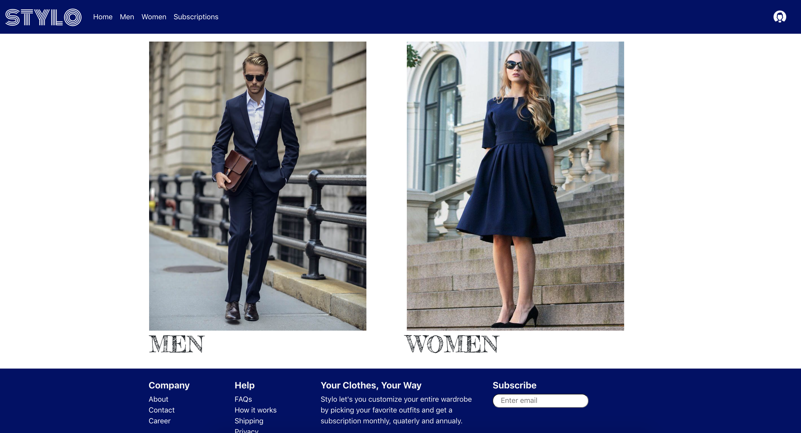
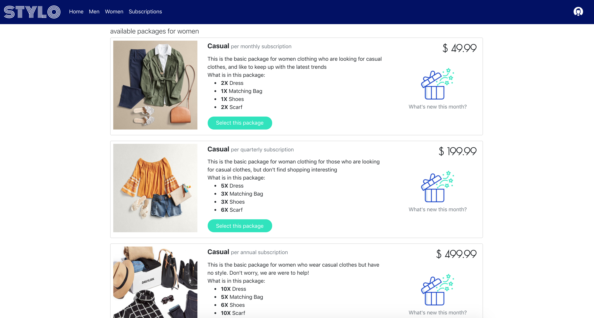
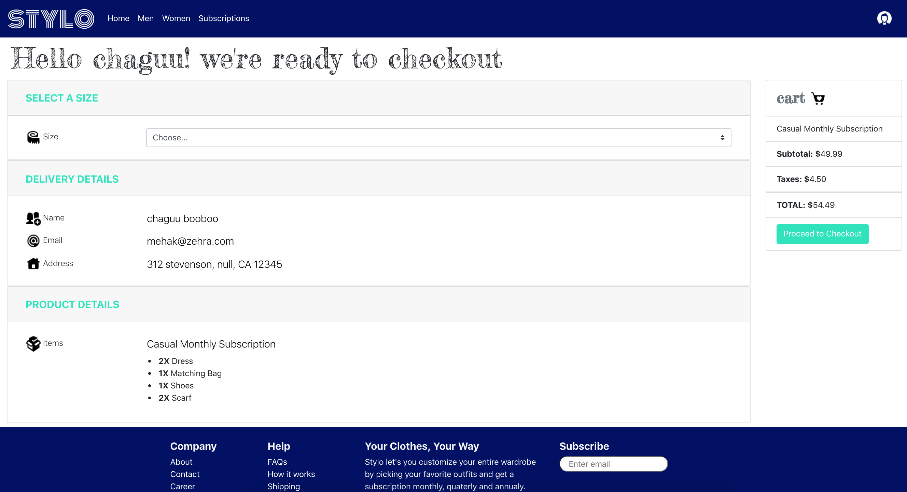
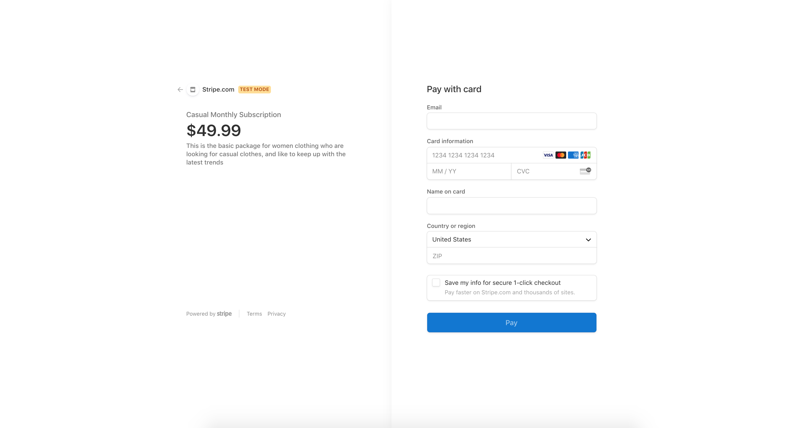
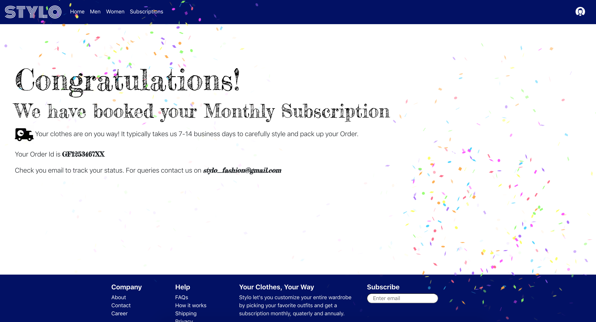
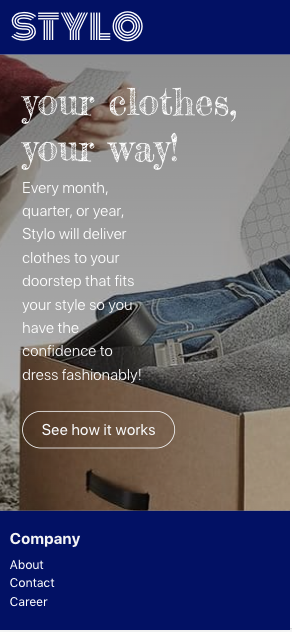
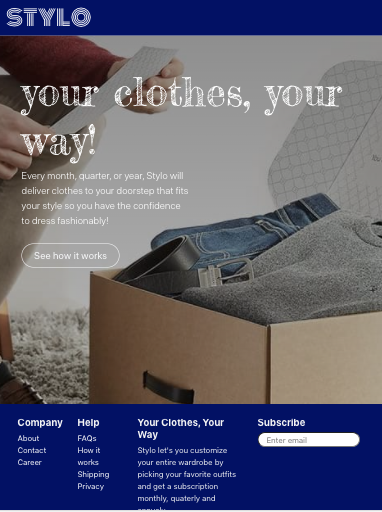

# Stylo
  ## Description  
  Stylo is an online subscription platform that aims to help people who don’t find shopping interesting or don’t have enough time to style themselves.

  ## Table Of Content  
  * [User Story](#userstory)
  * [Installation](#installation)
  * [Usage](#usage)
  * [Screenshots](#screeshots)
  * [Contributor](#contributor)
  * [Questions](#questions)

  ## User Story
    AS A USER,
    I WANT TO have an online subscription platform
    SO THAT I can get latest fashionable clothes delivered


 ## Installation  
  To install dependencies run this command 

  ```npm install```

  ## Usage  
  To keep our user intact with the latest fashion trends, If they don't have the time to shop. Stylo is providing a way where they could recieve fashionable clothes every month or so, so that they have the confidence to know that they're wearing the most fashionable clothes at any place. 


  ## License  
    None

## Screenshots
### Splash Page
  
### Signup Page
  
### Login Page
  
### Category Page
  

### Packages Page Women


### Checkout Page


### Stripe Payment Page


### Confirmation Page


### Mobile Splash Page


### Tablet Splash Page

## Technologies
### Frontend
    React 
    Bootstrap
### Backend
    GraphQL
    Node.js
    Express.js

### Database
    Database
    MongoDB 
    Mongoose ODM

### Additional Packages
    Stripe
    React Canvas Confetti   
    JWT authentication
    Bcrypt

## Future Development 
    Subscription (Edit and Cancel subscription) 
    Login with Gmail
    Additional categories
    Add to cart feature 
    Chat box with fashion consultant
    Filter by Category
    Fashion Quiz for user to determine preferences
    How it works detailed page
    Better catalog modal


## Live Link
https://mehak-stylo.herokuapp.com/

## GitHub Repo Link
https://github.com/mehak-zehra/stylo

  ## Contributor  
  Mehak Zehra 
  ## Questions  
  - - -
  For questions about this project, please see my GitHub at [mehak-zehra](https://github.com/mehak-zehra)  (Or) 

  Contact me at mehak.rizvi.786@gmail.com